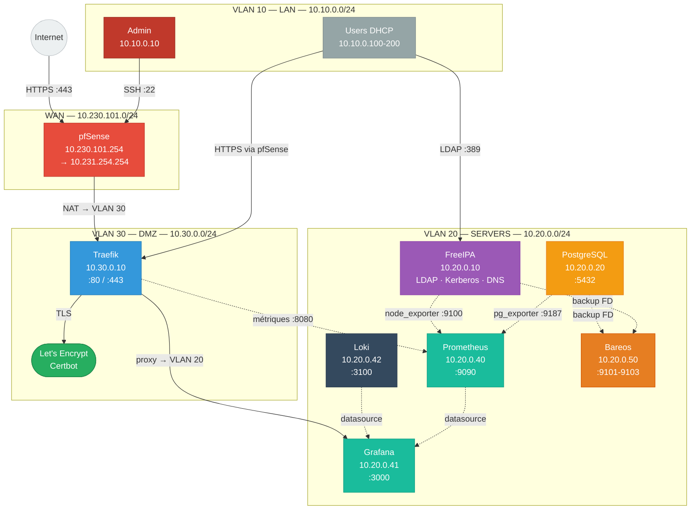

# ACME Corp — Infrastructure Hackathon 2026

Infrastructure d'entreprise sécurisée, observable et reproductible pour ACME Corp (50 salariés).
Proxmox 8.3.3 · LXC · Terraform · Ansible

## Démarrage rapide

```bash
# 1 — Provisionner les containers LXC
cd terraform
cp terraform.tfvars.example terraform.tfvars   # adapter les valeurs
terraform init && terraform apply

# 2 — Configurer tous les services
cd ../ansible
cp inventory/group_vars/vault.yml.example inventory/group_vars/vault.yml
ansible-vault edit inventory/group_vars/vault.yml
ansible-playbook playbooks/site.yml --ask-vault-pass

# 3 — Vérifier
ansible all -m ping
curl -sk https://grafana.acme.local/api/health
```

---

## Architecture réseau



---

## Containers LXC provisionnés

| CT | Hostname | IP | OS | VLAN | Rôle |
|----|----------|----|----|------|------|
| 101 | ipa | 10.20.0.10 | Rocky Linux 9 | 20 | FreeIPA — LDAP/Kerberos/DNS |
| 102 | pg | 10.20.0.20 | Debian 12 | 20 | PostgreSQL 15 |
| 104 | prometheus | 10.20.0.40 | Debian 12 | 20 | Prometheus + Alertmanager |
| 105 | grafana | 10.20.0.41 | Ubuntu 22.04 | 20 | Grafana |
| 106 | loki | 10.20.0.42 | Debian 12 | 20 | Loki + Promtail |
| 107 | bareos | 10.20.0.50 | Ubuntu 22.04 | 20 | Bareos |
| 201 | traefik | 10.30.0.10 | Debian 12 | 30 | Traefik reverse proxy |

---

## Politique firewall résumée

| Source | Destination | Port | Action |
|--------|-------------|------|--------|
| WAN | VLAN 30 : Traefik | 443/tcp | ALLOW |
| WAN | * | * | DENY |
| VLAN 10 | VLAN 30 : Traefik | 443/tcp | ALLOW |
| VLAN 10 | VLAN 20 : FreeIPA | 389,636,88/tcp+udp | ALLOW |
| VLAN 30 | VLAN 20 : Grafana | 3000/tcp | ALLOW |
| VLAN 20 | VLAN 20 | * | ALLOW |
| VLAN 20 | WAN | 80,443/tcp | ALLOW |

Politique complète : [docs/firewall-policy.md](docs/firewall-policy.md)

---

## Accès aux services

| Service | URL (via Traefik) | Accès direct |
|---------|-------------------|--------------|
| Grafana | https://grafana.acme.local | http://10.20.0.41:3000 |
| FreeIPA WebUI | https://ipa.acme.local | http://10.20.0.10 |
| Traefik dashboard | https://traefik.acme.local | http://10.30.0.10:8080 |
| Prometheus | — interne — | http://10.20.0.40:9090 |
| Alertmanager | — interne — | http://10.20.0.40:9093 |
| Loki | — interne — | http://10.20.0.42:3100 |

---

## Arborescence du dépôt

```
HACKATHON_2026/
├── AGENT.md                        # Contexte global agents IA
├── README.md                       # Ce fichier
├── terraform/                      # Provisioning LXC Proxmox
│   ├── AGENT.md
│   ├── main.tf                     # Provider proxmox
│   ├── variables.tf                # Réseau, templates, credentials
│   ├── outputs.tf
│   ├── terraform.tfvars.example
│   ├── freeipa.tf                  # CT 101
│   ├── postgresql.tf               # CT 102
│   ├── prometheus.tf               # CT 104
│   ├── grafana.tf                  # CT 105
│   ├── loki.tf                     # CT 106
│   ├── bareos.tf                   # CT 107
│   └── traefik.tf                  # CT 201
├── ansible/                        # Configuration des services
│   ├── AGENT.md
│   ├── ansible.cfg
│   ├── inventory/
│   │   ├── hosts.yml
│   │   └── group_vars/all.yml + vault.yml
│   ├── playbooks/site.yml + *.yml
│   └── roles/ (freeipa, postgresql, prometheus, grafana, loki, bareos, traefik, certbot)
├── monitoring/                     # Configs Prometheus, Grafana, Loki
│   ├── AGENT.md
│   ├── prometheus/alerts/rules.yml
│   ├── grafana/dashboards/
│   └── loki/loki-config.yml + promtail-config.yml
├── app/                            # Application métier (à définir)
│   └── AGENT.md
└── docs/
    ├── firewall-policy.md
    └── decisions.md
```

---

## Redéploiement complet (procédure jury)

```bash
# Prérequis : terraform.tfvars + vault.yml renseignés, bridges vmbr2/vmbr3 sur Proxmox

# Étape 1 — Containers LXC (~2 min)
cd terraform && terraform apply -auto-approve

# Étape 2 — Services (~15 min)
cd ../ansible && ansible-playbook playbooks/site.yml --ask-vault-pass

# Vérification
ansible all -m ping
curl -sk https://grafana.acme.local/api/health | jq
curl http://10.20.0.40:9090/api/v1/query?query=up | jq '.data.result[] | {job:.metric.job, up:.value[1]}'
```

---

## Observabilité

```bash
# État des targets Prometheus
curl -s http://10.20.0.40:9090/api/v1/targets | jq '.data.activeTargets[] | {job:.labels.job, health:.health}'

# Requête Loki — erreurs LDAP
logcli query '{job="freeipa"} |= "INVALID_CREDENTIALS"' --addr=http://10.20.0.42:3100
```

---

## Sauvegarde et restauration

```bash
# Déclencher un backup PostgreSQL via bconsole (sur bareos)
echo -e "run job=backup-postgresql yes\nwait\nquit" | bconsole

# Restauration PostgreSQL
pg_restore -U postgres -d acme_app /var/backups/postgresql/acme_app_<date>.dump
```

---

## Décisions techniques — résumé

Voir [docs/decisions.md](docs/decisions.md).

| Choix | Justification |
|-------|---------------|
| LXC plutôt que VMs | Plus léger, démarrage rapide, adapté au lab Proxmox |
| pfSense | Firewall éprouvé, GUI pour démo, restauration XML |
| Traefik | Certbot intégré, dashboard, config dynamique |
| FreeIPA | LDAP + Kerberos + DNS tout-en-un sur Rocky Linux 9 |
| Loki | 10× plus léger qu'ELK, natif Grafana |
| Bareos | OSS, backup PostgreSQL natif, WebUI pour démo |
