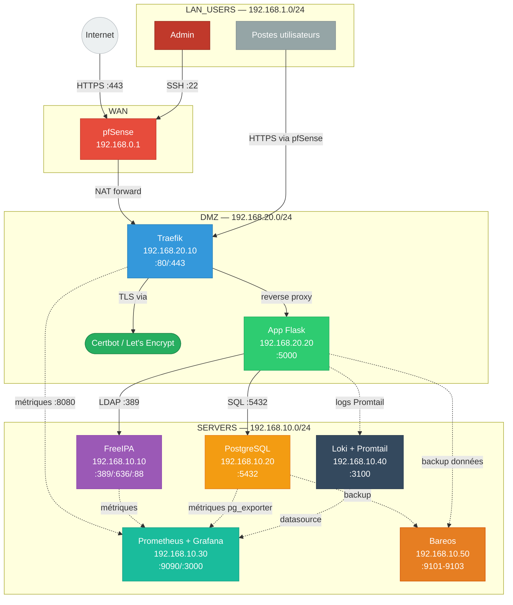
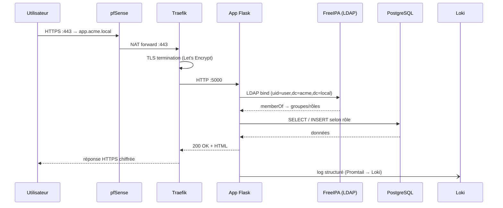

# ACME Corp — Infrastructure Hackathon 2026

Infrastructure d'entreprise sécurisée, observable et reproductible pour ACME Corp (50 salariés).

## Démarrage rapide

```bash
# 1. Cloner le dépôt
git clone <repo> && cd HACKATHON_2026

# 2. Provisionner les VMs (Proxmox requis)
cd terraform
cp terraform.tfvars.example terraform.tfvars   # adapter les valeurs
terraform init && terraform apply

# 3. Configurer toute l'infrastructure
cd ../ansible
cp inventory/group_vars/vault.yml.example inventory/group_vars/vault.yml
ansible-vault edit inventory/group_vars/vault.yml   # renseigner les secrets
ansible-playbook playbooks/site.yml

# 4. Lancer l'application métier
cd ../app && docker compose up -d

# 5. Vérifier l'état
curl -k https://app.acme.local/health
```

---

## Architecture réseau



---

## Flux d'authentification



---

## Zones et politique firewall résumée

| Source | Destination | Port | Action |
|--------|-------------|------|--------|
| WAN | DMZ:Traefik | 443/tcp | ALLOW |
| WAN | * | * | DENY |
| DMZ:App | SERVERS:FreeIPA | 389,636/tcp | ALLOW |
| DMZ:App | SERVERS:PostgreSQL | 5432/tcp | ALLOW |
| DMZ:App | SERVERS:Loki | 3100/tcp | ALLOW |
| LAN_USERS | DMZ | 443/tcp | ALLOW |
| LAN_USERS | SERVERS:FreeIPA | 389,636,88/tcp+udp | ALLOW |
| SERVERS | SERVERS | * | ALLOW |
| SERVERS | WAN | 80,443/tcp | ALLOW |

Politique complète : [docs/firewall-policy.md](docs/firewall-policy.md)

---

## Services et accès

| Service | URL | Credentials |
|---------|-----|-------------|
| Application interne | https://app.acme.local | LDAP (FreeIPA) |
| Grafana | https://grafana.acme.local | admin / voir vault |
| FreeIPA WebUI | https://ipa.acme.local | admin / voir vault |
| Traefik dashboard | https://traefik.acme.local | basic auth |
| Bareos WebUI | https://bareos.acme.local | admin / voir vault |

---

## Arborescence

```
HACKATHON_2026/
├── AGENT.md                        # Contexte global agents IA
├── README.md                       # Ce fichier
├── terraform/                      # Provisioning VMs Proxmox
│   ├── AGENT.md
│   ├── main.tf
│   ├── variables.tf
│   ├── outputs.tf
│   ├── terraform.tfvars.example
│   └── modules/vm/ + modules/network/
├── ansible/                        # Configuration services
│   ├── AGENT.md
│   ├── ansible.cfg
│   ├── inventory/hosts.yml + group_vars/
│   ├── playbooks/site.yml + *.yml
│   └── roles/ (freeipa, traefik, postgresql, prometheus, grafana, loki, bareos, certbot)
├── app/                            # Application Flask
│   ├── AGENT.md + README.md
│   ├── docker-compose.yml + Dockerfile
│   └── src/ (app.py, models/, routes/, templates/)
├── monitoring/                     # Prometheus, Grafana, Loki
│   ├── AGENT.md
│   ├── prometheus/ + grafana/ + loki/
└── docs/
    ├── architecture.md
    ├── firewall-policy.md
    └── decisions.md
```

---

## Redéploiement complet (procédure jury — 20 min)

```bash
# Prérequis : Proxmox + terraform.tfvars + vault.yml renseignés

# Étape 1 — VMs (~5 min)
cd terraform && terraform apply -auto-approve

# Étape 2 — Services (~15 min)
cd ../ansible && ansible-playbook playbooks/site.yml

# Étape 3 — Application (~1 min)
cd ../app && docker compose up -d

# Vérification globale
curl -sk https://app.acme.local/health | jq
```

---

## Tests

```bash
# Healthcheck
curl -sk https://app.acme.local/health

# Test de charge K6
k6 run app/tests/k6/smoke.js
k6 run app/tests/k6/load.js

# Test LDAP
ldapsearch -H ldap://192.168.10.10 \
  -D "uid=admin,cn=users,cn=accounts,dc=acme,dc=local" \
  -W -b "dc=acme,dc=local" "(objectClass=posixAccount)"

# Vérifier les métriques Prometheus
curl http://192.168.10.30:9090/api/v1/query?query=up
```

---

## Décisions techniques

Voir [docs/decisions.md](docs/decisions.md).

| Choix | Justification |
|-------|---------------|
| pfSense | Firewall éprouvé, GUI pour démo rapide, XML restore |
| Traefik | Auto-découverte Docker, Certbot intégré, dashboard |
| FreeIPA | LDAP + Kerberos + DNS tout-en-un, UI web incluse |
| Flask | Léger, lisible jury, LDAP3 simple, 0 magie |
| Loki | 10x moins lourd qu'ELK, compatible Grafana natif |
| Bareos | OSS, backup PostgreSQL via bareos-fd, restore CLI |
| Proxmox/Terraform | IaC reproductible, snapshots pour démo restore |
